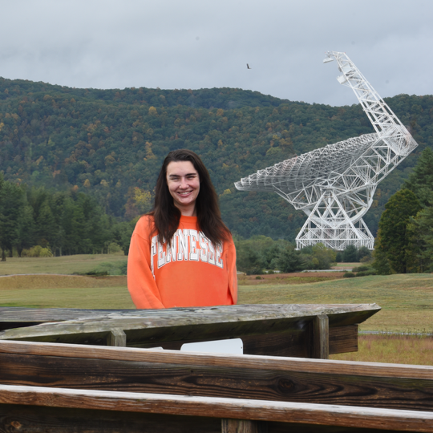

::: {layout='[30,70]'}
{style='border-radius:50%; width:100%'}

Hi, nice to meet you! I'm Haley Scolati, a Postdoctoral Research Fellow at the beautiful University of British Columbia. I am an astrochemist with research interests in radio astronomy and applied machine learning. My graduate work initially started using chirped pulse Fourier-transform microwave (CP-FTMW) spectroscopy as an analytical method for small deuterated chiral molecules. I later became a collaborator in the GOTHAM (GBT Observations of TMC-1: Hunting Aromatic Molecules) large program on the Green Bank Telescope where I made the decision to pivot my graduate research to realign myself more closely with the astrochemical community. The remainder of my doctoral research focused on applying machine learning in various astrochemical and radio astronomy problems, including column density predictions for future molecular survey targets and benchmarking dimensionality reduction methods for high-dimensional ALMA datacubes. I was advised by Dr. Eric Herbst (UVA) and well as Dr. Anthony Remijan (NRAO) while a Reber Fellow at the National Radio Astronomy Observatory.

Because two cross country moves wasn’t enough, I packed my car and cats a third time (this time over a border) to UBC where I am now a Postdoctoral Research Fellow studying the use of foundation models in collaboration with Dr. Geoff Pleiss (UBC Statistics) to explore the chemical space of astrochemical reactions and their processes. In my free time, I enjoy everything outdoors, from hiking to softball and soccer as well as exploring the city for new restaurants and thrift spots.

While this page is under construction, please feel free to browse my CV!

:::

This is a Quarto website.

To learn more about Quarto websites visit <https://quarto.org/docs/websites>.
